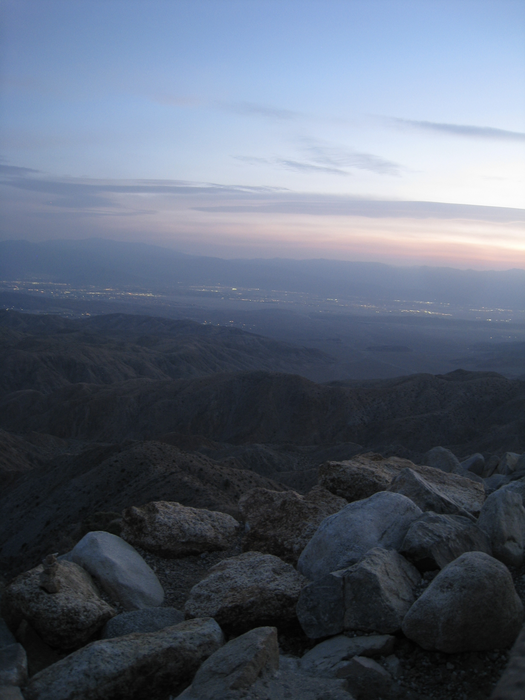
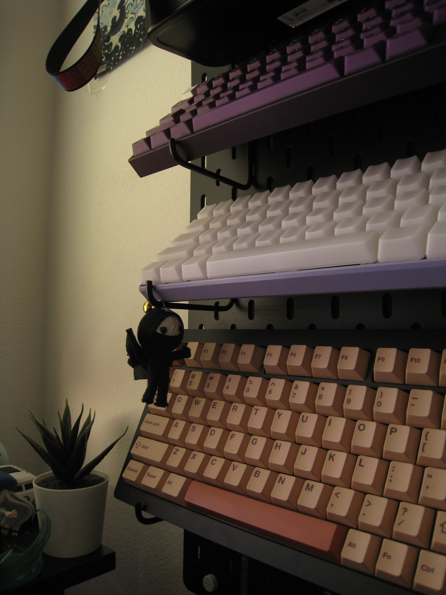

# All About Me
Hi! I am Jude Raphael Gamba.

## Sections:
- [All About Me](#all-about-me)
  - [Sections:](#sections)
  - [Major and Education](#major-and-education)
  - [My Goals](#my-goals)
  - [Work Experience](#work-experience)
    - [Student Intern](#student-intern)
    - [Web Development Intern](#web-development-intern)
  - [Background](#background)
  - [Personal Interests](#personal-interests)

## Major and Education
I am currently a second-year **computer science** major at **UC San Diego**. I am also interested in minoring in **cognitive science**.

## My Goals
- [] Build Meaningful Projects
- [] Land Internships that I believe reflect my interests
- [] Graduate with Honors

How to land an internship?
```
git commit to-your-goals
git push past-limitations
```

## Work Experience
I have been responsible for responding to customer feedback and offering effective assistance in a timely manner. I proactively found solutions to ensure quality service to constituents. As part of a team under a government agency, I conducted research and formulated plans to resolve immediate issues.

### Student Intern
City of San Diego
June 17, 2024 -August 16, 2024
<br/>
Key Contributions:
- Researched innovative solutions to issues withing various departments in the City of Sand Diego.
- Collaborated with a 7 person team to propose solutions and create a group presentation to summarize the proposed solutions.

### Web Development Intern
City of San Diego
September, 2024 - present
<br/>
Key Contributions:
- Updated and maintained the City's website using PHP, html, CSS, and javascript
- Administration of the City's webpages using Drupal(CMS)

## Background
A little bit about my background, I have been living in San Diego almost my entire life. Specifically my hometown is [Imperial Beach, California](https://g.co/kgs/Fm2hRgA). Living next to the beach growing up has given me a strong appreciation of nature and the environment.  
One of the quotes I live by is:
> "Just living is not enough... one must have sunshine, freedom, and a little flower." 

Life is not all about the work you do but also what you do outside of it. Looking to the outdoors for time away from screens and responsibilities allows me to reflect on my own motivations.
<!-- insert images of recent travels-->


## Personal Interests
Aside from going outdoors, one of my favorite hobbies is building keyboards! So far I have been able to build 6 keyboards and hopefully I am able to create more interesting and different sounding keyboards in the future. Keyboard building is a lot easier than people think. It involves these steps:
1. Find a case that represents you(something in your price range)
2. Find switches that match your preference(thocky, clicky?)
3. Find keycaps that match your aesthetic
4. Lube your switches(optional because it takes way too long)
5. Put it all together(switches->keycaps0)
<!-- insert images here for keyboard builds-->



